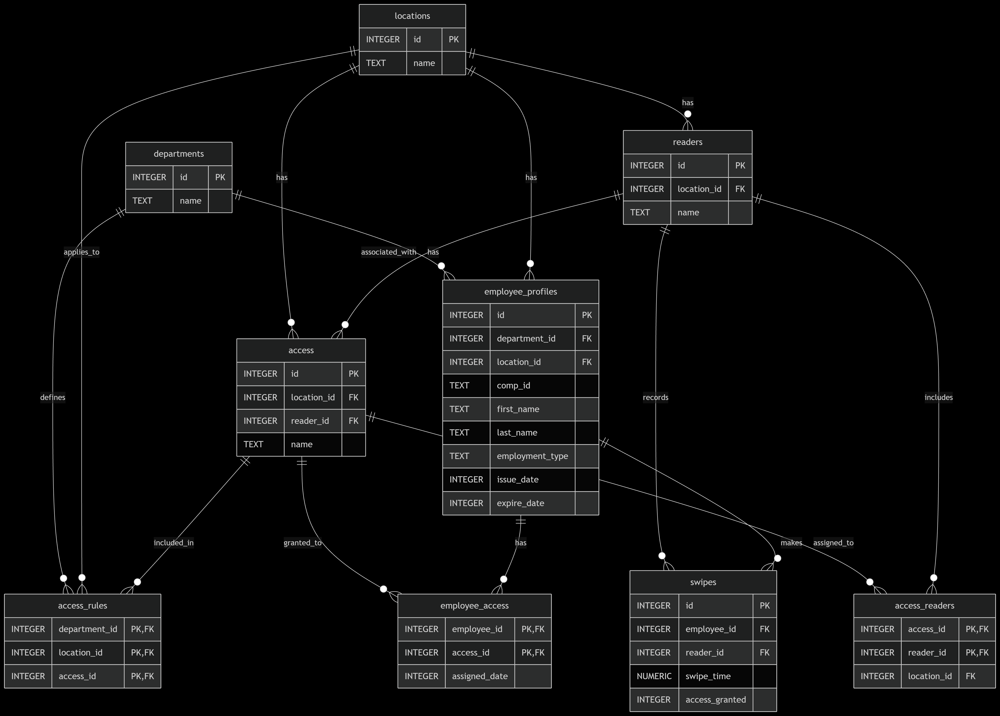

# AccessControl SQLite Project

A comprehensive access control database system for multi-location organizations, built with SQLite and designed for enterprise-level security management.

## 🔐 Overview

This project implements a robust access control database that manages employee access across multiple physical locations and security zones. The system tracks employee badge usage, manages access permissions by department and location, and provides detailed audit trails for security compliance.

**Video Overview**: [YouTube Demo](https://www.youtube.com/watch?v=h3H3I_UrFZM)

## ✨ Features

### Core Functionality
- **Multi-Location Support**: Manage access across Belgrade, Boston, Jakarta, Melbourne, and Santiago
- **Department-Based Access**: Role-based permissions for HR, Finance, ITS, Sales, and Support teams
- **Real-Time Monitoring**: Live tracking of badge swipes and access attempts
- **Automated Employee Onboarding**: Automatic access profile assignment based on department/location rules
- **Comprehensive Auditing**: Detailed access logs and employee access reports

### Security Features
- **Access Profile Management**: Configurable clearance levels and reader assignments
- **Automated ID Generation**: Company ID format validation and generation
- **Badge Expiration Tracking**: Contract-based access expiration management
- **Access Validation**: Real-time verification of employee permissions

### Database Features
- **Optimized Performance**: Strategic indexing for fast queries
- **Data Integrity**: Comprehensive foreign key constraints and validation
- **Automated Triggers**: Smart business logic implementation
- **Materialized Views**: Pre-computed reports for quick access audits

## 🏗️ Architecture

### Database Schema
The system uses a normalized SQLite database with the following core entities:

- **Departments**: Organizational units with specific access requirements
- **Locations**: Physical sites requiring access control
- **Readers**: Access control devices at entry points
- **Access Profiles**: Security clearance levels and permissions
- **Employee Profiles**: Staff information and badge data
- **Swipe Events**: Real-time access attempt logging

### Key Relationships
- Many-to-many relationship between access profiles and readers
- Department-location-access rule mapping
- Employee access inheritance through organizational rules
- Complete audit trail through swipe event tracking

## 📊 Database Design



The database implements a sophisticated access control model with:
- **Junction Tables**: Managing complex many-to-many relationships
- **Composite Keys**: Ensuring data integrity across related entities
- **Cascade Constraints**: Maintaining referential integrity
- **Check Constraints**: Enforcing business rules at the database level

## 🚀 Getting Started

### Prerequisites
- SQLite 3.x
- SQL client (DB Browser for SQLite, DBeaver, or similar)

### Installation
1. Clone the repository:
```bash
git clone https://github.com/gooliverani/AccessControl-SQLite_Project.git
cd AccessControl-SQLite_Project
```

2. Open the database:
```bash
sqlite3 access_control.db
```

3. Explore the schema:
```sql
.schema
.tables
```

### Quick Start
```sql
-- View all active employees and their access profiles
SELECT * FROM current_employee_access;

-- Check recent swipe activity
SELECT 
    ep.comp_id,
    ep.first_name || ' ' || ep.last_name as employee_name,
    r.name as reader_name,
    l.name as location,
    datetime(s.swipe_time) as swipe_time,
    CASE s.access_granted 
        WHEN 1 THEN 'GRANTED' 
        ELSE 'DENIED' 
    END as access_status
FROM swipes s
JOIN employee_profiles ep ON s.employee_id = ep.id
JOIN readers r ON s.reader_id = r.id
JOIN locations l ON r.location_id = l.id
ORDER BY s.swipe_time DESC
LIMIT 10;
```

## 📁 Project Structure

```
AccessControl-SQLite_Project/
├── README.md                  # This file
├── DESIGN.md                  # Comprehensive design documentation
├── access_control.db          # Main SQLite database
├── schema.sql                 # Database schema definition
├── queries.sql                # Sample queries and reports
├── comp_id_audit.sql         # Company ID audit procedures
├── first_last_swipe.sql      # Employee activity analysis
├── test.sql                  # Database testing queries
├── report.csv                # Sample data export
└── diagram.png               # Entity Relationship Diagram
```

## 🔍 Key Queries and Reports

### Employee Access Audit
```sql
-- Get comprehensive employee access report
SELECT * FROM current_employee_access 
WHERE total_access_profiles > 0
ORDER BY department, employee_name;
```

### Security Monitoring
```sql
-- Find employees with failed access attempts
SELECT DISTINCT
    ep.comp_id,
    ep.first_name || ' ' || ep.last_name as employee_name,
    COUNT(*) as failed_attempts
FROM swipes s
JOIN employee_profiles ep ON s.employee_id = ep.id
WHERE s.access_granted = 0
  AND date(s.swipe_time) = date('now')
GROUP BY ep.id, ep.comp_id, employee_name
HAVING failed_attempts > 3;
```

### Access Pattern Analysis
```sql
-- Analyze peak access times by location
SELECT 
    l.name as location,
    strftime('%H', s.swipe_time) as hour,
    COUNT(*) as swipe_count
FROM swipes s
JOIN readers r ON s.reader_id = r.id
JOIN locations l ON r.location_id = l.id
WHERE date(s.swipe_time) >= date('now', '-7 days')
GROUP BY l.name, hour
ORDER BY l.name, hour;
```

## 🛠️ Database Optimizations

### Indexes
- **Composite Indexes**: Optimized multi-column queries for readers and access profiles
- **Performance Indexes**: Fast employee expiration checks and swipe analysis
- **Foreign Key Indexes**: Accelerated join operations

### Triggers
- **Company ID Validation**: Enforces naming convention (FirstInitial + LastInitial + 6 digits)
- **Automatic Access Assignment**: Auto-assigns permissions based on department/location rules
- **Name Change Handling**: Updates company IDs when employee names change

### Views
- **current_employee_access**: Real-time employee access summary for audits
- **Materialized Patterns**: Cached complex joins for frequent security reviews

## 📈 Use Cases

### Security Administration
- **Employee Onboarding**: Automated access profile assignment
- **Access Reviews**: Regular certification of employee permissions
- **Incident Investigation**: Detailed audit trails for security events
- **Compliance Reporting**: Ready-made views for regulatory requirements

### Facility Management
- **Reader Configuration**: Manage access control devices across locations
- **Zone Management**: Define and modify security zones and clearance levels
- **Capacity Planning**: Analyze facility usage patterns

### HR Integration
- **Badge Management**: Track employee badge lifecycle and expiration
- **Department Transfers**: Automatic access profile updates
- **Contractor Management**: Temporary access with expiration dates

## 🚧 Limitations & Future Enhancements

### Current Limitations
- **Fixed Locations**: Hardcoded location list requires schema changes for new sites
- **Single Location Assignment**: Employees limited to one primary location
- **Basic Audit Trail**: Limited historical tracking of access rule changes
- **No Hierarchical Structures**: Flat location model without building/floor support

### Planned Enhancements
- **Cloud IAM Integration**: Microsoft Entra ID and Workday HCM connectivity
- **Role-Based Database Access**: Enhanced security with MySQL/PostgreSQL migration
- **Badge Printing Integration**: Automated badge production workflow
- **Advanced Analytics**: Machine learning for anomaly detection
- **Mobile API**: REST API for mobile access management apps

## 📝 Documentation

- **[DESIGN.md](DESIGN.md)**: Comprehensive technical documentation
- **[Entity Relationship Diagram](diagram.png)**: Visual database schema
- **SQL Files**: Well-commented queries and procedures

## 🤝 Contributing

1. Fork the repository
2. Create a feature branch (`git checkout -b feature/AmazingFeature`)
3. Commit your changes (`git commit -m 'Add some AmazingFeature'`)
4. Push to the branch (`git push origin feature/AmazingFeature`)
5. Open a Pull Request

## 📄 License

This project is licensed under the MIT License - see the [LICENSE](LICENSE) file for details.

## 👤 Author

**Vladimir Vukojičić**

- GitHub: [@gooliverani](https://github.com/gooliverani)
- Project Video: [YouTube Overview](https://www.youtube.com/watch?v=h3H3I_UrFZM)

## 🙏 Acknowledgments

- Built as part of CS50 SQL coursework
- Inspired by real-world enterprise access control requirements
- Database design follows industry best practices for security and performance

---

⭐ **Star this repository if you find it useful!**
